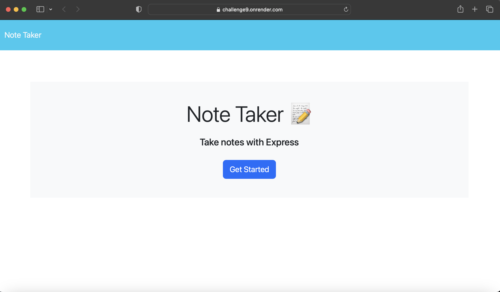

# Challenge 9 Assignment 

  []

## Table of Content
  -[Description](#Description)
  -[Installation](#Installation)
  -[Usage](#Usage)
  -[Licenses](#Licenses)
  -[Contribution](#Contribution)
  -[Test](#Test)
  -[Questions](#Questions)

## Description
  This challenge allowed me to build my first full stack  application. This application is a note taker that allows the user to save notes for daily tasks.

## Installation
  Just visit the url in the usage area to use.

## Usage
  Please visit: https://challenge9.onrender.com

  

## Licenses
    License:   
 
 This project is licensed under the [MIT License](https://opensource.org/licenses/MIT) 

## Contribution
  Please email for contributions!

## Test
  No set tests for application. 

## Questions
   Please contact us with questions at:
    Github: [GitHub](https://github.com/aakabia)

    Email: akabia199597@gmail.com

